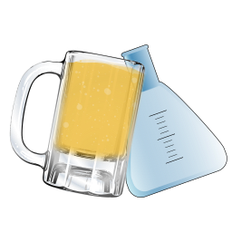
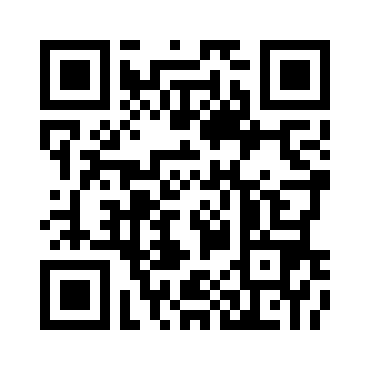
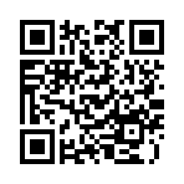

# :beer: Drunk-For-Science :beer:

A public experiment and study on the effects of alcohol
- - -

## What you'll need
- A [breathalyzer](https://www.amazon.com/s?ie=UTF8&page=1&rh=i%3Aaps%2Ck%3Abreathalyzer)
- A shot glass of a known volume

## Contributing
Please see:
- [Contributing guidelines](./CONTRIBUTING.md)
- [Report an issue](https://github.com/shgysk8zer0/Drunk-For-Science/issues/new)

## Buy me a beer :beer:

[Bitcoin Address: 17HiggdwVHAey27pxrea3ihKMiV9VK8BHY](bitcoin:17HiggdwVHAey27pxrea3ihKMiV9VK8BHY)
